# 算法讲解

## 算法思想

使用多个带注意力机制的图神经网络分别提取 User-Item、User-User 和 Item-User 三种关系图的用户和商品信息，通过融合源自上述三种图的关系信息，从而实现预测性能更强的推荐系统。

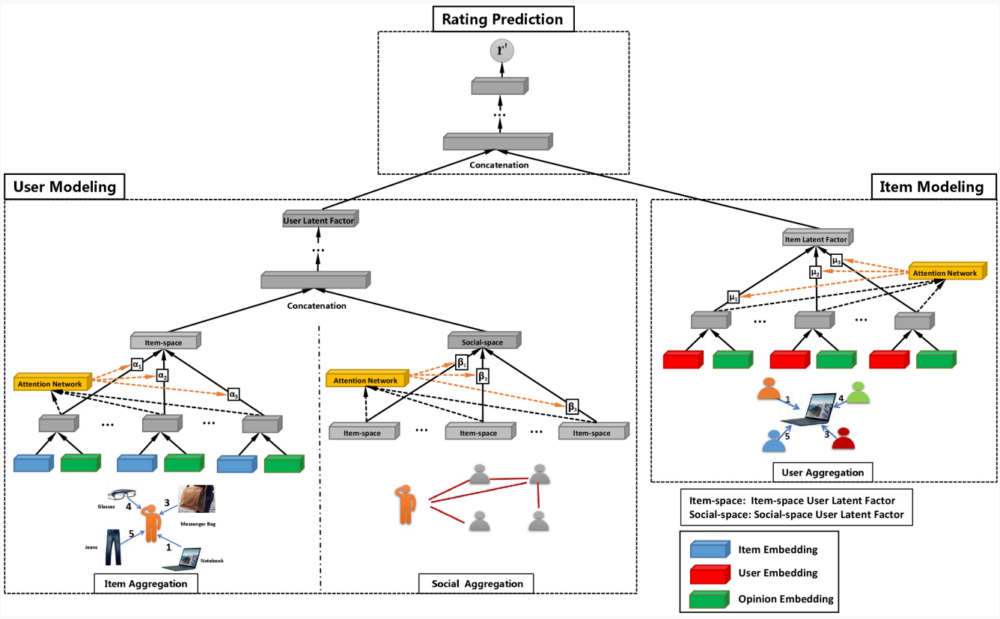

## User-Item建模

GraphRec算法的第一步是将用户和商品之间的历史行为记录视为一个带权图，使用GNN进行建模。形式化定义如下所示，即对于被用户 $i$ 关联的所有商品 $a$ ，使用聚合函数 $Arrgre_{items}$ 对商品的 Embedding 表示 $x_{ia}$ 进行聚合，最终得到用户的特征向量 $h^I_i$ 。

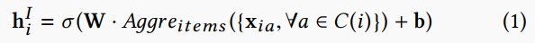

上面公式中被用户 $i$ 关联的商品 $a$ 的 Embedding 包含了两部分信息，即商品表征 $q_a$ ，以及用户 $i$ 对商品的评分 $e_r$ 。

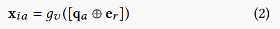

在聚合函数上，GraphRec 选择了基于 Attention 的 GNN 聚合函数。

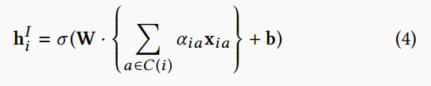

注意力分数即为用户 Embedding 和 融合了评分信息的商品 Embedding 进行拼接后，进过两层神经网络得到的 $\alpha$ 值

在计算完注意力分数后，需要对 $\alpha$ 进行归一化处理

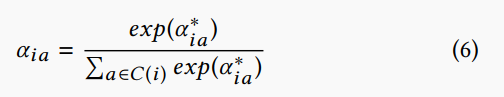

最终，根据 Attention 分数，我们就可以得到每个用户的特征向量 $h^I_i$

## User-User建模

社交关系建模利用了上一节的 User-Item 关系建模得到的 User 信息。即对于被用户 $i$ 关联的所有用户 $o$ ，使用聚合函数 $Arrgre_{neigbhors}$ 对用户的特征向量 $h^I_o$ 进行聚合，最终得到用户的社交向量 $h^I_i$ 。

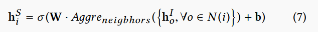

在GNN的聚合部分，社交关系建模和上面的用户行为建模是类似的。即通过用户基础表征 $p_i$ 和邻居用户的特征向量 $h^I_o$ 计算 Attention 分数 $\beta_{io}$ ，然后将该 Attention 分数用于邻居向量聚合。

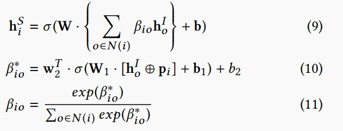

最终，在得到了基于社交关系和用户行为的用户表征之后，可以通过一个MLP将两个表征进行融合，形成一个最终的用户表征 $h_i$ 。

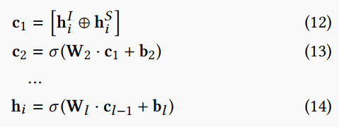

## Item-User建模

前两节介绍了用户表征建模，在 GraphRec 算法中，该算法还对 Item 进行了类似的建模。即对于被商品 $j$ 关联的所有用户 $t$ ，使用聚合函数 $Arrgre_{users}$ 对用户的Embedding向量 $f_{jt}$ 进行聚合，最终得到商品的行为表征 $z_j$ 。

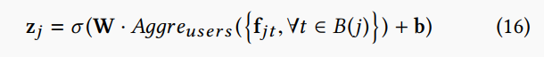

对于商品关联的用户表征 $f_{jt}$ ，可以融合用户基本表征 $p_t$ 和评分表征 $e_r$ ，得到包含评分的关联用户表征。

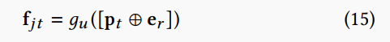

然后，通过Attention机制融合商品关联的用户表征 $f_{jt}$ ，得到最终的 Item 表征 $z_j$ 。

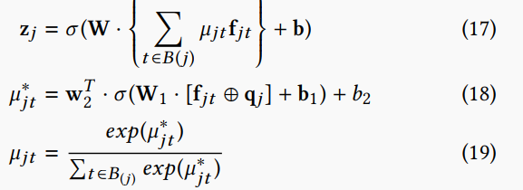

## 模型训练

有了 User 表征 $h_i$ 和 Item 表征 $z_j$ 之后，直接将两个表征进行拼接，输入到MLP中完成预测即可。

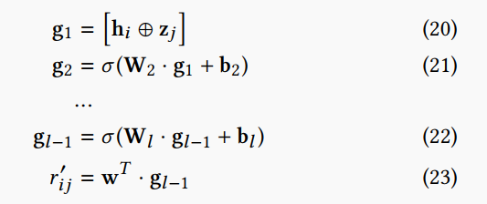

最终的预测目标是预测评分的MSE最小

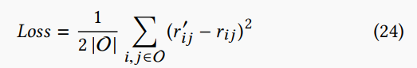

