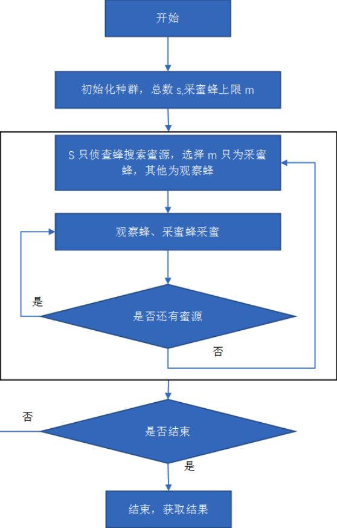

# 人工蜂群算法

## 算法背景

人工蜂群算法 (Artificial Bee Colony, ABC) 是由 Karaboga 于 2005 年提出的一种新颖的基于集群智能的全局优化算法，其直观背景来源于蜂群的采蜜行为。它的主要特点是不需要了解问题的特殊信息，只需要对问题进行优劣的比较，通过各人工蜂个体的局部寻优行为，最终在群体中使全局最优值突现出来，有着较快的收敛速度。

蜜蜂是一种群居昆虫，虽然单个昆虫的行为极其简单，但是由单个简单的个体所组成的群体却表现出极其复杂的行为。真实的蜜蜂种群能够在任何环境下，以极高的效率从食物源（花朵）中采集花蜜；同时，它们能适应环境的改变。


## 搜索流程

算法的调用过程如下：

```shell
初始化所有蜜源

记录最优蜜源

while:

	雇佣蜂对所有蜜源进行邻域搜索（避免饥饿效应）

	计算轮盘度，判断蜜源质量

	观察蜂对优质蜜源进行邻域搜索（加速算法收敛）

	记录最优蜜源

	侦查蜂放弃枯竭蜜源进行全局搜索（跳出局部最优）

	记录最优蜜源

end
```


其中雇佣蜂和观察蜂有着相似的逻辑，特别在对指定蜜源进行邻域搜索时，两者的逻辑是完全的一样的：

1. 基于原有蜜源进行邻域突变
2. 保证邻域突变的有效性
3. 若为优质突变，则进行蜜源替换
4. 若为劣质突变，则进行蜜源开采

但是算法的设计者们却特意区分出两种不同的逻辑，其原因可以从实现代码中看出。在进行领域搜索时，对指定蜜源的选择和限定是关键所在，它暗示了雇佣蜂和观察蜂的区别以及承担的不同角色。

首先对于雇佣蜂的角色，其指定蜜源的方式简单粗暴，对每一个蜜源进行遍历指定。通过这种方式进行邻域搜索，是建立整个算法的基础核心。

而对于观察蜂角色，它是根据轮盘赌策略进行蜜源的指定，也就是说，蜜源越是优质，其被指定的、被进行领域搜索的概率就越高。通过这种正向反馈的过程，加速了整个算法的收敛性，可以帮助我们在多个局部中快速找到最优解。

如此看来观察蜂似乎是雇佣蜂的进化版，观察蜂似乎可以完全替代雇佣蜂？其实不然。观察蜂角色在进行快速收敛、对优质蜜源进行了较多照顾的同时，劣质的蜜源可能会被忽略，从而产生饥饿效应。而雇佣蜂的角色让所有的蜜源，不论优劣，都有能够持续搜索的机会，雇佣蜂和观察蜂相互配合，使得算法能够均衡高效的执行。

最后的角色是侦查蜂。当持续的搜索使得蜜源枯竭的时候，侦查蜂对枯竭的蜜源进行放弃，跳出原有的局部空间，在全局空间中随机探索新的蜜源，之后转变为雇佣蜂重复上述过程。





## Java 实现

主函数

```java
public class test {
	// 建立蜂群
    static beeColony bee = new beeColony();

    public static void main(String[] args) {
        int iter = 0;
        int run = 0;
        int j = 0;
        double mean = 0;
        //srand(time(NULL));

		// 重复计算，获得平均情况下的全局最优解
        for (run = 0; run < bee.runtime; run++) {
          	// 初始化蜜源
            bee.initial();
            bee.MemorizeBestSource();
            for (iter = 0; iter < bee.maxCycle; iter++) {
                // 雇佣蜂的逻辑： 更新所有蜜源（确保能跳出局部蜜源）
                bee.SendEmployedBees();
                bee.CalculateProbabilities();
                // 观察蜂的逻辑： 好蜜源正向反馈（加速收敛的作用）
                bee.SendOnlookerBees();
                bee.MemorizeBestSource();
                // 仅仅重制枯竭的蜜源 (局部优质蜜源枯竭的快)
                bee.SendScoutBees();
            }
            // 打印最优的坐标，以及最终的函数值
            for (j = 0; j < bee.D; j++) {
                //System.out.println("GlobalParam[%d]: %f\n",j+1,GlobalParams[j]);
                System.out.println("GlobalParam[" + (j + 1) + "]:" + bee.GlobalParams[j]);
            }
            //System.out.println("%d. run: %e \n",run+1,GlobalMin);
            System.out.println((run + 1) + ".run:" + bee.GlobalMin);
            bee.GlobalMins[run] = bee.GlobalMin;
            mean = mean + bee.GlobalMin;
        }
        mean = mean / bee.runtime;
        //System.out.println("Means of %d runs: %e\n",runtime,mean);
        System.out.println("Means  of " + bee.runtime + "runs: " + mean);
    }
}
```

算法函数

```java
import java.lang.Math;

public class beeColony {


    /* Control Parameters of ABC algorithm*/
    int NP = 20; /* The number of colony size (employed bees+onlooker bees)*/
    int FoodNumber = NP / 2; /*The number of food sources equals the half of the colony size*/
    int limit = 100;  /*A food source which could not be improved through "limit" trials is abandoned by its employed bee*/
    int maxCycle = 2500; /*The number of cycles for foraging {a stopping criteria}*/

    /* Problem specific variables*/
    int D = 100; /*The number of parameters of the problem to be optimized*/
    double lb = -5.12; /*lower bound of the parameters. */
    double ub = 5.12; /*upper bound of the parameters. lb and ub can be defined as arrays for the problems of which parameters have different bounds*/


    int runtime = 30;  /*Algorithm can be run many times in order to see its robustness*/

    int dizi1[] = new int[10];
    double Foods[][] = new double[FoodNumber][D];        /*Foods is the population of food sources. Each row of Foods matrix is a vector holding D parameters to be optimized. The number of rows of Foods matrix equals to the FoodNumber*/
    double f[] = new double[FoodNumber];        /*f is a vector holding objective function values associated with food sources */
    double fitness[] = new double[FoodNumber];      /*fitness is a vector holding fitness (quality) values associated with food sources*/
    double trial[] = new double[FoodNumber];         /*trial is a vector holding trial numbers through which solutions can not be improved*/
    double prob[] = new double[FoodNumber];          /*prob is a vector holding probabilities of food sources (solutions) to be chosen*/
    double solution[] = new double[D];            /*New solution (neighbour) produced by v_{ij}=x_{ij}+\phi_{ij}*(x_{kj}-x_{ij}) j is a randomly chosen parameter and k is a randomlu chosen solution different from i*/


    double ObjValSol;              /*Objective function value of new solution*/
    double FitnessSol;              /*Fitness value of new solution*/
    int neighbour, param2change;                   /*param2change corrresponds to j, neighbour corresponds to k in equation v_{ij}=x_{ij}+\phi_{ij}*(x_{kj}-x_{ij})*/

    double GlobalMin;                       /*Optimum solution obtained by ABC algorithm*/
    double GlobalParams[] = new double[D];                   /*Parameters of the optimum solution*/
    double GlobalMins[] = new double[runtime];
    /*GlobalMins holds the GlobalMin of each run in multiple runs*/
    double r; /*a random number in the range [0,1)*/

    /*a function pointer returning double and taking a D-dimensional array as argument */
    /*If your function takes additional arguments then change function pointer definition and lines calling "...=function(solution);" in the code*/


//	typedef double (*FunctionCallback)(double sol[D]);  

    /*benchmark functions */

//	double sphere(double sol[D]);
//	double Rosenbrock(double sol[D]);
//	double Griewank(double sol[D]);
//	double Rastrigin(double sol[D]);

    /*Write your own objective function name instead of sphere*/
//	FunctionCallback function = &sphere;

    /*Fitness function*/
    double CalculateFitness(double fun) {
        double result = 0;
        if (fun >= 0) {
            result = 1 / (fun + 1);
        } else {

            result = 1 + Math.abs(fun);
        }
        return result;
    }

    /*The best food source is memorized*/
    void MemorizeBestSource() {
        int i, j;

        for (i = 0; i < FoodNumber; i++) {
            if (f[i] < GlobalMin) {
                GlobalMin = f[i];
                for (j = 0; j < D; j++)
                    GlobalParams[j] = Foods[i][j];
            }
        }
    }

    /*Variables are initialized in the range [lb,ub]. If each parameter has different range, use arrays lb[j], ub[j] instead of lb and ub */
    /* Counters of food sources are also initialized in this function*/


    void init(int index) {
        int j;
        for (j = 0; j < D; j++) {
            r = ((double) Math.random() * 32767 / ((double) 32767 + (double) (1)));
            Foods[index][j] = r * (ub - lb) + lb;
            solution[j] = Foods[index][j];
        }
        f[index] = calculateFunction(solution);
        fitness[index] = CalculateFitness(f[index]);
        trial[index] = 0;
    }


    /*All food sources are initialized */
    void initial() {
        int i;
        for (i = 0; i < FoodNumber; i++) {
            init(i);
        }
        GlobalMin = f[0];
        for (i = 0; i < D; i++)
            GlobalParams[i] = Foods[0][i];


    }

    void SendEmployedBees() {
        int i, j;
        /*Employed Bee Phase*/
        for (i = 0; i < FoodNumber; i++) {
            /*The parameter to be changed is determined randomly*/
            r = ((double) Math.random() * 32767 / ((double) (32767) + (double) (1)));
            param2change = (int) (r * D);

            /*A randomly chosen solution is used in producing a mutant solution of the solution i*/
            r = ((double) Math.random() * 32767 / ((double) (32767) + (double) (1)));
            neighbour = (int) (r * FoodNumber);

            /*Randomly selected solution must be different from the solution i*/
            // while(neighbour==i)
            // {
            // r = (   (double)Math.random()*32767 / ((double)(32767)+(double)(1)) );
            // neighbour=(int)(r*FoodNumber);
            // }
            for (j = 0; j < D; j++)
                solution[j] = Foods[i][j];

            /*v_{ij}=x_{ij}+\phi_{ij}*(x_{kj}-x_{ij}) */
            r = ((double) Math.random() * 32767 / ((double) (32767) + (double) (1)));
            solution[param2change] = Foods[i][param2change] + (Foods[i][param2change] - Foods[neighbour][param2change]) * (r - 0.5) * 2;

            /*if generated parameter value is out of boundaries, it is shifted onto the boundaries*/
            if (solution[param2change] < lb)
                solution[param2change] = lb;
            if (solution[param2change] > ub)
                solution[param2change] = ub;
            ObjValSol = calculateFunction(solution);
            FitnessSol = CalculateFitness(ObjValSol);

            /*a greedy selection is applied between the current solution i and its mutant*/
            if (FitnessSol > fitness[i]) {

                /*If the mutant solution is better than the current solution i, replace the solution with the mutant and reset the trial counter of solution i*/
                trial[i] = 0;
                for (j = 0; j < D; j++)
                    Foods[i][j] = solution[j];
                f[i] = ObjValSol;
                fitness[i] = FitnessSol;
            } else {   /*if the solution i can not be improved, increase its trial counter*/
                trial[i] = trial[i] + 1;
            }


        }

        /*end of employed bee phase*/

    }

    /* A food source is chosen with the probability which is proportioal to its quality*/
    /*Different schemes can be used to calculate the probability values*/
    /*For example prob(i)=fitness(i)/sum(fitness)*/
    /*or in a way used in the metot below prob(i)=a*fitness(i)/max(fitness)+b*/
    /*probability values are calculated by using fitness values and normalized by dividing maximum fitness value*/
    void CalculateProbabilities() {
        int i;
        double maxfit;
        maxfit = fitness[0];
        for (i = 1; i < FoodNumber; i++) {
            if (fitness[i] > maxfit)
                maxfit = fitness[i];
        }

        for (i = 0; i < FoodNumber; i++) {
            prob[i] = (0.9 * (fitness[i] / maxfit)) + 0.1;
        }

    }

    // just add choose tactic, the center logic is as same as sendEmployedBees
    void SendOnlookerBees() {

        int i, j, t;
        i = 0;
        t = 0;
        /*onlooker Bee Phase*/
        while (t < FoodNumber) {

            r = ((double) Math.random() * 32767 / ((double) (32767) + (double) (1)));
            if (r < prob[i]) /*choose a food source depending on its probability to be chosen*/ {
                t++;

                /*The parameter to be changed is determined randomly*/
                r = ((double) Math.random() * 32767 / ((double) (32767) + (double) (1)));
                param2change = (int) (r * D);

                /*A randomly chosen solution is used in producing a mutant solution of the solution i*/
                r = ((double) Math.random() * 32767 / ((double) (32767) + (double) (1)));
                neighbour = (int) (r * FoodNumber);

                /*Randomly selected solution must be different from the solution i*/
                while (neighbour == i) {
                    //System.out.println(Math.random()*32767+"  "+32767);
                    r = ((double) Math.random() * 32767 / ((double) (32767) + (double) (1)));
                    neighbour = (int) (r * FoodNumber);
                }
                for (j = 0; j < D; j++)
                    solution[j] = Foods[i][j];

                /*v_{ij}=x_{ij}+\phi_{ij}*(x_{kj}-x_{ij}) */
                r = ((double) Math.random() * 32767 / ((double) (32767) + (double) (1)));
                solution[param2change] = Foods[i][param2change] + (Foods[i][param2change] - Foods[neighbour][param2change]) * (r - 0.5) * 2;

                /*if generated parameter value is out of boundaries, it is shifted onto the boundaries*/
                if (solution[param2change] < lb)
                    solution[param2change] = lb;
                if (solution[param2change] > ub)
                    solution[param2change] = ub;
                ObjValSol = calculateFunction(solution);
                FitnessSol = CalculateFitness(ObjValSol);

                /*a greedy selection is applied between the current solution i and its mutant*/
                if (FitnessSol > fitness[i]) {
                    /*If the mutant solution is better than the current solution i, replace the solution with the mutant and reset the trial counter of solution i*/
                    trial[i] = 0;
                    for (j = 0; j < D; j++)
                        Foods[i][j] = solution[j];
                    f[i] = ObjValSol;
                    fitness[i] = FitnessSol;
                } else {   /*if the solution i can not be improved, increase its trial counter*/
                    trial[i] = trial[i] + 1;
                }
            } /*if */
            i++;
            if (i == FoodNumber)
                i = 0;
        }/*while*/

        /*end of onlooker bee phase     */
    }

    /*determine the food sources whose trial counter exceeds the "limit" value. In Basic ABC, only one scout is allowed to occur in each cycle*/
    void SendScoutBees() {
        int maxtrialindex, i;
        maxtrialindex = 0;
        // 遍历当前所有食物源，寻找最大的trail
        for (i = 1; i < FoodNumber; i++) {
            if (trial[i] > trial[maxtrialindex])
                maxtrialindex = i;
        }
        if (trial[maxtrialindex] >= limit) {
            init(maxtrialindex);
        }
    }

		// target function for calculate
    double calculateFunction(double sol[]) {
        return Rastrigin(sol);
    }

    double sphere(double sol[]) {
        int j;
        double top = 0;
        for (j = 0; j < D; j++) {
            top = top + sol[j] * sol[j];
        }
        return top;
    }

    double Rosenbrock(double sol[]) {
        int j;
        double top = 0;
        for (j = 0; j < D - 1; j++) {
            top = top + 100 * Math.pow((sol[j + 1] - Math.pow((sol[j]), (double) 2)), (double) 2) + Math.pow((sol[j] - 1), (double) 2);
        }
        return top;
    }

    double Griewank(double sol[]) {
        int j;
        double top1, top2, top;
        top = 0;
        top1 = 0;
        top2 = 1;
        for (j = 0; j < D; j++) {
            top1 = top1 + Math.pow((sol[j]), (double) 2);
            top2 = top2 * Math.cos((((sol[j]) / Math.sqrt((double) (j + 1))) * Math.PI) / 180);

        }
        top = (1 / (double) 4000) * top1 - top2 + 1;
        return top;
    }

    double Rastrigin(double sol[]) {
        int j;
        double top = 0;

        for (j = 0; j < D; j++) {
            top = top + (Math.pow(sol[j], (double) 2) - 10 * Math.cos(2 * Math.PI * sol[j]) + 10);
        }
        return top;
    }
}

```


**参考链接**

[1] [https://abc.erciyes.edu.tr/](https://abc.erciyes.edu.tr/)

[2] [https://en.wikipedia.org/wiki/Test_functions_for_optimization](https://en.wikipedia.org/wiki/Test_functions_for_optimization)

[3] [https://www.pianshen.com/article/729179041/](https://www.pianshen.com/article/729179041/)

[4] [https://www.jianshu.com/p/ebd436d27cf8](https://www.jianshu.com/p/ebd436d27cf8)


