## 随机游走算法

### 目录

1. 算法思想
2. 算法定义
3. 算法实例
4. 参考文献

### 算法思想

PageRank 算法最初作为互联网网页重要度的计算方法，1996年由 Page 和 Brin 提出，并用于谷歌搜索引擎的网页排序。PageRank 算法可以看作是随机游走模型的一个实例[1]。

PageRank 的思想是，在任意一个网页上，浏览者或者以概率 $d$ 决定按照超链接随机跳转，这时以等概率从连接出去的超链接跳转到下一个网页；或者以概率 $(1 - d)$ 决定完全随机跳转，这时以等概率 $1/n$ 跳转到任意一个网页。第二个机制保证从没有连接出去的超链接的网页也可以跳转出来。每次游走后得出一个概率分布，该概率分布刻画了图中每一个网页被访问到的概率，用这个概率分布作为下一次游走的输入并反复迭代这一过程。当满足一定前提条件时，这个概率分布会趋于收敛，即可以得到一个稳定的概率分布[2]。

### 算法定义

#### a) PageRank 的简单定义

PageRank 的基本定义是理想化的情况，在这种情况下，PageRank存在，而且可以通过不断迭代求得 PageRank 值

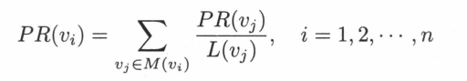

在公式中，$PR(v_i)$ 是结点 $vi$ 被点击的概率，$M(v_i)$ 是所有指向节点 $v_i$ 的节点集合，$L(j)$ 是节点 $v_j$ 连出边的个数。

#### b) PageRank 的一般定义

PageRank 一般定义的想法是在基本定义的基础上导入平滑项

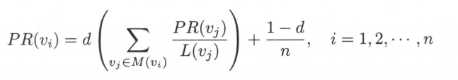

在公式中，$PR(v_i)$ 是结点 $vi$ 被点击的概率，$d$ 是用户连续访问结点的概率，$n$ 是所有结点的数量，$M(v_i)$ 是所有指向节点 $v_i$ 的节点集合，$L(j)$ 是节点 $v_j$ 连出边的个数。其中，节点 $v_i$  被点击到的概率由两部分组成，用户随机点击到节点 $v_i$ 的概率 $\cfrac{1 - d}{n}$ 和用户连续点击到节点 $v_i$ 的概率。

### 算法实例

#### a) 简单的 PageRank

已知有向图如下，求该图的 PageRank

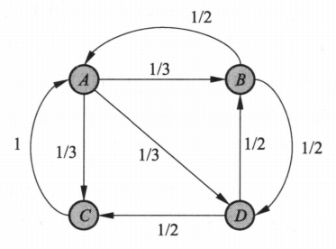

1. 画出对应的转移矩阵

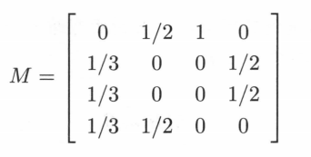

2. 取初始分部量 $R_0$ 为

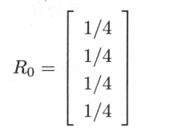

3. 以转移矩阵 $M$ 连乘初始向量 $R_0$ 得到向量序列

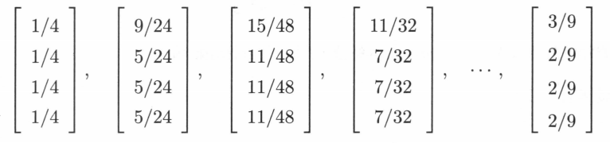

4. 最后得到收敛的极限向量

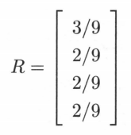

已知有向图如下，其中结点 $C$ 没有出边，求该图的 PageRank，

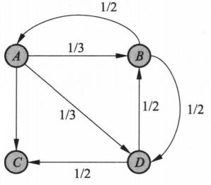

1. 画出对应的转移矩阵

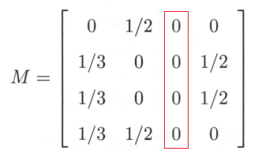

2. 计算各个时刻的结点向量的概率分布

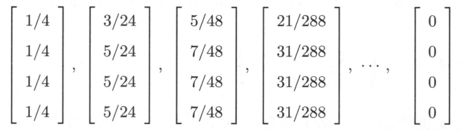

可以看出，简单的 PageRank 并不适用于一般情况，如果遇到的结点没有连出去的边，比如点击的网页没有连接出去的超链接，那么从这些网页将无法跳转到其他网页，随着对初始概率分布的不断迭代，各个结点的点击概率皆变成0。

#### b) 一般的 PageRank

已知有向图如下，其中结点 $C$ 没有出边，取 $d = 0.8$，求该图的 PageRank

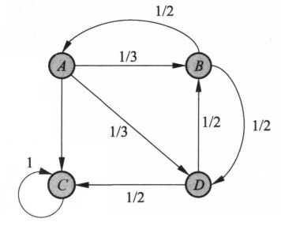

1. 结合平滑因子 $d$，计算基本转移矩阵 $M$ 和完全随机的转移矩阵

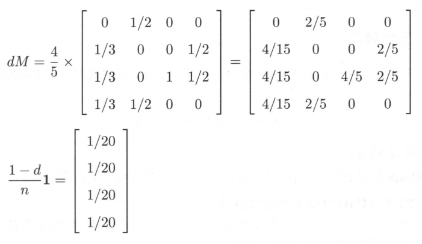

2. 得到迭代公式为

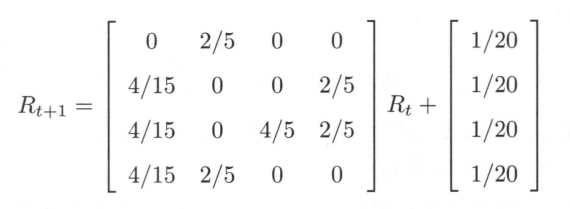

3. 取初始向量 $R_0$ 带入迭代公式得到向量序列

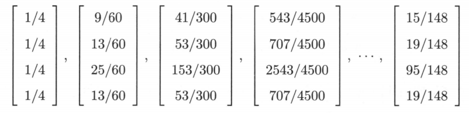

4. 计算结果表明，结点 $C$ 的 PageRank 值超过一般，其他结点也有相应的 PageRank 值。

### 参考文献

| 篇名                                                         | 期刊/会议  | 作者        | 时间    |
| ------------------------------------------------------------ | ---------- | ----------- | ------- |
| [1] The page rank citation ranking: Bringing order to the web |            | Page L      | 1998    |
| [2] 一种基于随机游走模型的标签分类算法                       | 计算机学报 | 郑伟        | 2010.08 |
| [3] Mining of massive datasets                               |            | Rajaraman A | 2014    |
| 统计学习方法（第2版）--第21章                                |            | 李航        | 2019.05 |

### 引用文献

