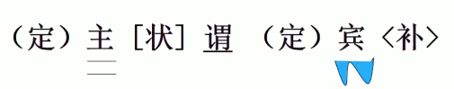
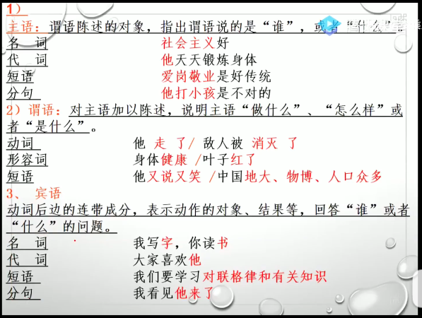
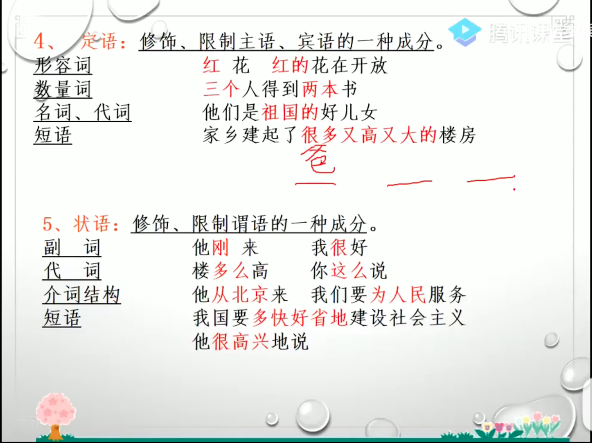
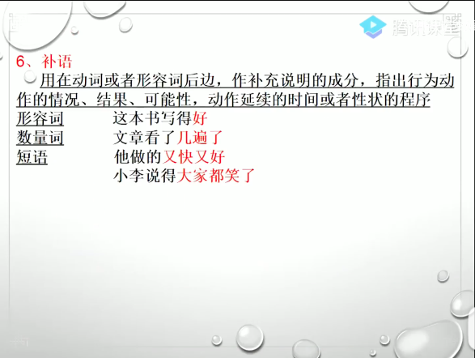
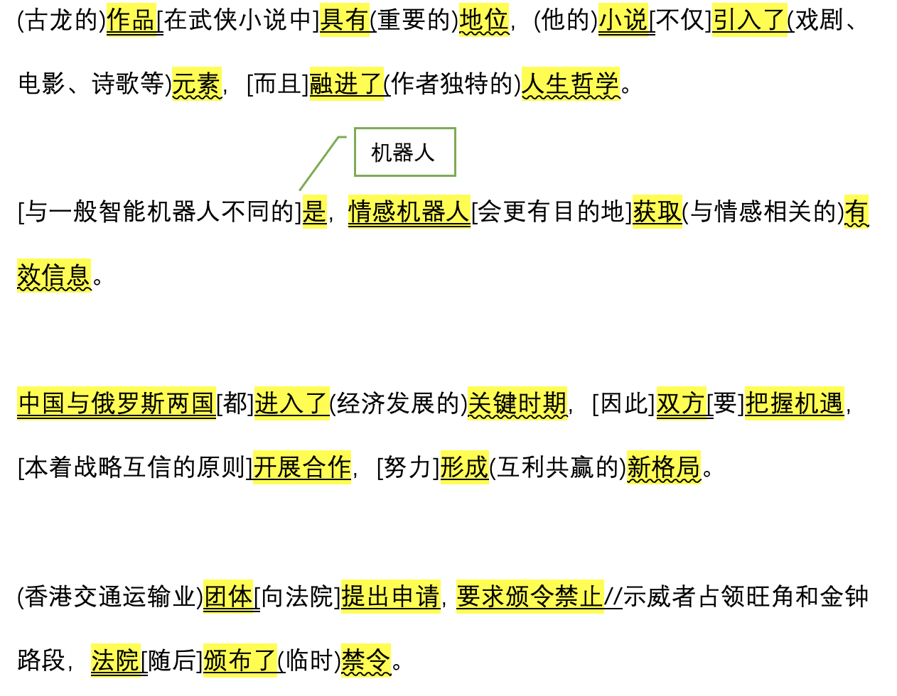
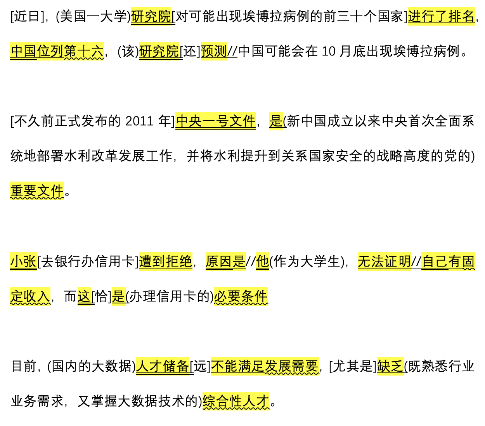

## 简易语法


### 一、实词

名动形、数量代

* 名词：表示人或事物名称的词
* 动词：表示动作行为及发展变化多的词
* 形容词：表示事物性质、状貌状态的词

* 数词：表示事物数目的词

* 量词：表示事物或动作的单位

* 代词：能代替各类实词的词，代替、指示或表示疑问的作用


### 二、虚词

副介连、助叹拟，没有实际意义的词

* 副词：起修饰或限制**动词**或**形容词**作用、表程度或范围的词
* 介词：用在名词、代词或名词性词组前面，合起来表示方向、对象等的词（介宾短语）
* 连词：连接词、短语或句子的词


### 三、单句

概念：单句是由词或短语构成，表示相对完整意思的语言使用单位

成分：主语、谓语、宾语、定语、状语、补语

句子符号：

| 谓语 | 主语 | 宾语 | 定语 | 状语 | 补语 |
| ---- | ---- | ---- | ---- | ---- | ---- |
| —    | ==   | ~~~  | ()   | []   | <>   |



* 主语、谓语、宾语的构成



* 定语、状语的构成



* 补语的构成




总结

```
1. 定语常能带"的"
2. 介宾结构做状语,状语可在句首尾
3. 约定俗成主语常省略,主语顺延会省略
4. 主干不通加定状
5. 主宾分句画两次
6. 宽泛划分不局限,能合并就合并
```


### 四、语法练习

  


