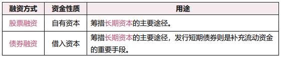

# 3.1 证券发行人

## 目录

1. 证券市场融资活动
2. 证券发行人

## 一、证券市场融资活动

证券市场融资活动，是指资金盈余单位和赤字单位之间以有家证券为媒介，实现资金融通的金融活动。其方式主要包括：股票融资、债券融资。

## 二、证券发行人

* **政府和政府机构**，政府发行债券，中央银行发行股票和用于调控货比供给量的特殊债券
* **企业**，

* **金融机构**，作为证券市场的主体，既发行债券，也发行股票。