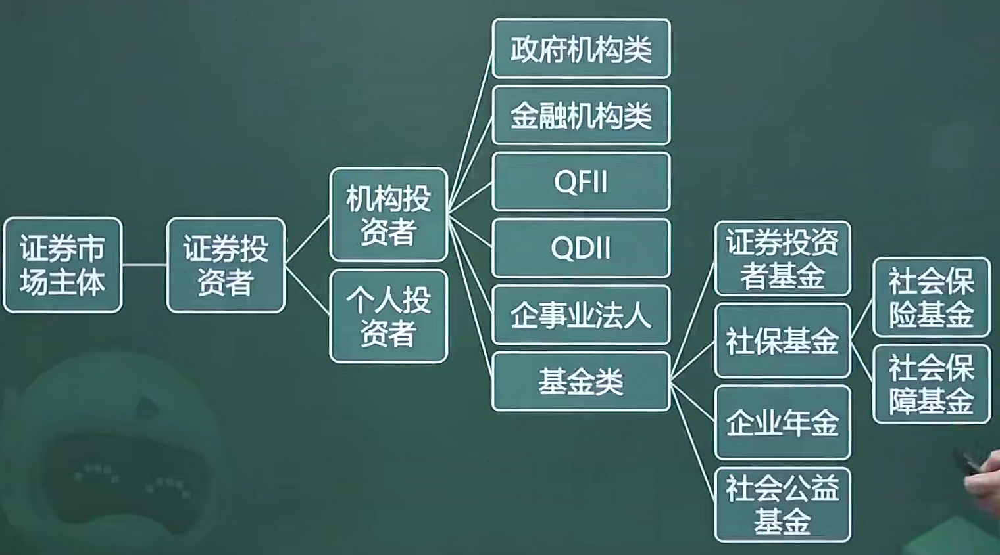

# 3.2 证券投资者（6）

## 目录

1. 证券市场投资者概述
1. 机构投资者
1. 个人投资者

## 一、证券市场投资者概述

证券市场投资者，是指以取得**利息**、**股息**或**资本收益**为目的，购买并持有有价证券，承担证券投资风险并行使证券权利的主体。

分类

* 根据投资者身份：机构投资者、个人投资者
* 根据持有证券时间的长短：短线投资者、中线投资者、长线投资者
* 根据投资者心理因素：稳健、冒险、中庸

## 二、机构投资者

机构投资者，是指用自由资金或者从分散的公众手里筹集的资金，以获得证券投资收益为主要经营目的的**专业团体机构或企业**。

* 特点：投资资金规模化、投资管理专业化、投资结构组合化、投资行为规范化

主要包括

* **政府机构投资者**，是指进行证券投资的**政府机构**。其特点为：调剂资金余缺、实施宏观调控、实行特定产业政策
* **金融机构类投资者**，是指进行证券投资、从事金融资产交易的金融机构，包括**证券**经营机构、**银行**业金融机构、**保险**公司以及其他金融机构。
* **合格境外机构投资者**（QFII），是经中国证监会批准，使用来自境外的资金进行境内证券期货投资的境外机构投资者。
* **合格境内机构投资者**（QDII），是指经一国金融管理当局审批通过，获准直接投资境外股票或者债券市场的国内机构投资者。
* **企业和事业法人机构投资者**，企业可以用自己积累的资金或暂时不用的**闲置资金**进行证券投资，事业法人可以用自有资金和有权支配的**预算外**资金进行证券投资。
* **基金类投资者**，包括证券投资基金、社保基金、企业年金、社会公益基金

合格境内机构投资者制度

1. 基金管理公司：净资产不少于**2亿元**人民币，经营证券投资基金管理业务达**2年**以上，在最近一个季度末资产管理规模不少于**200亿元**人民币或等值外汇资产。
2. 证券公司：净资本不低于**8亿元**人民币，净资本与净资产比例不低于**70%**，经营集合资产管理计划业务达**1年**以上，最经一个季度末资产管理规模不少于**20亿元**人民币或等值外汇资产。

## 三、个人投资者

个人投资者，是指从事证券投资的社会自然人。

* 特点：资金规模有限、专业知识相对匮乏、投资行为具有随意性、分散性和短期性、投资的灵活性强
* 风险特征构成要素：风险偏好、风险认知度、实际风险承受能力
* 对待风险和收益的态度：风险偏好型、风险中立型、风险规避型
