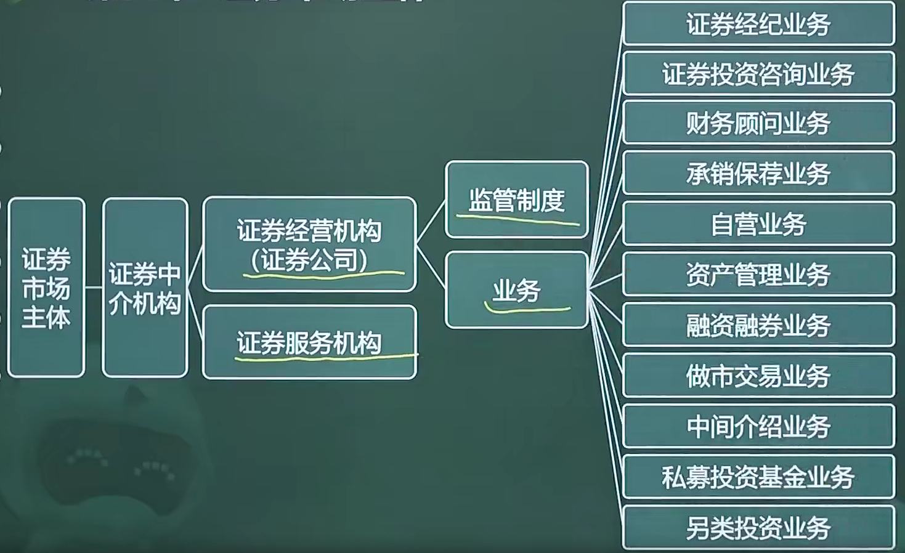

# 3.3 证券中介机构（4）

## 目录

1. 证券公司概述
2. 证券公司的主要业务
3. 证券服务机构
4. 证券金融公司

## 一、证券公司概述

证券公司，是指依照《公司法》和《证券法》设立的经营证券业务的有限责任公司或股份有限公司。在我国，设立证券公司必须进过**国务院证券监督管理机构**审查批准。

## 二、证券公司的主要业务

* **证券经纪业务**，是指证券公司接受客户委托**代理**客户买卖有价证券的业务，经纪委托关系的建立表现为**开户**和**委托**两个环节。
* **证券投资咨询业务**，是指从事证券投资咨询业务的机构及其咨询人员为证券投资人或客户提供**证券投资分析**、**预测**或**建议**等直接或者间接有偿咨询服务的活动。
* **财务顾问业务**，是指与证券交易、证券投资活动有关的咨询、建议、策划业务。
* **证券承销与保荐业务**，是指证券公司代理证券发行人发行证券的行为。
* **证券自营业务**，是指证券公司以**自有资金**或**依法筹集的资金**，为本公司买卖特定的证券，以获取盈利的行为。若投资规模合计不超过其**净资本80%**，则无需取得证券自营业务资格。
* **证券资产管理业务**，是指金融机构接受投资者委托，对受托的投资者财产进行投资和管理的金融服务。
* **融资融券业务**，是指证券公司指向客户出借资金供其买入证券或者出借证券供其卖出，并收取担保物的经营活动。融资交易指客户向证券公司借资金买证券，融券交易指客户向证券公司借证券卖出。
* 证券做市交易业务（黄牛）、证券公司中间介绍业务、私募投资基金业务和另类投资业务

证券公司申请融资融券业务资格的条件

1. 具有证券经纪业务资格
2. 公司**最近两年内**不存在因涉嫌违法违规正被中国证监会立案调查或者正处于整改期间的情形
3. 财务状况良好，**最近两年**各项风险指标持续符合规定
4. 信息系统安全稳定运行，**最近一年**未发生因公司管理问题导致的重大事故

开展融资融券业务的要求

1. 经中国证监会批准
2. 以自己的名义在证券登记结算机构开立账户
3. 以自己的名义在商业银行开立账户

证券公司中间介绍业务的业务范围

1. 协助办理开户手续
2. 提供期货行情信息、交易设施
3. 中国证监会规定的其他服务

## 三、证券服务机构

证券服务机构是指依法设立的从事证券服务业务的法人机构。包括，会计师事务所、律师事务所、资产评估机构、资信评级机构、财务顾问机构、信息技术系统服务机构

以上服务机构首次从事证券服务行业，应在签订服务协议之日起**10个工作日**内向中国证监会备案。

## 四、证券金融公司

证券金融公司也被称为证券融资公司，证券金融公司将自有或者依法筹集的资金和证券出借给证券公司，以供其办理融资融券业务的经营活动。
