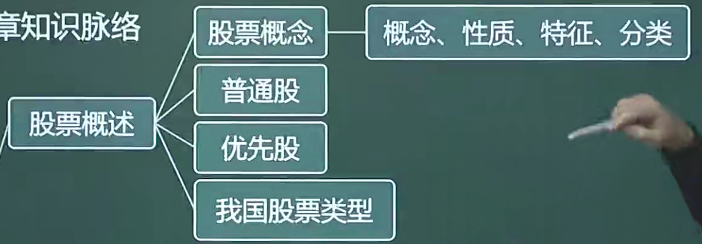

# 4.1 股票概述（5）

## 目录

1. 股票概述
2. 相关的资本管理概念
3. 普通股与优先股
4. 我国股票的类型

## 一、股票概述

股票是一种有价证券，它是股份有限公司签发的证明股东所持股份的凭证。股票实质上代表了股东对股份有限公司净资产的所有权。

* 性质：有价证券、要式证券、政权证券、资本证券、综合权力证券
* 特征：收益性、价格波动和风险性、流动性、永久性、参与性
* 分类：
  * 按股东享有的权利不同，分为普通股票和特别股票
  * 按是否记载股东姓名，分为记名股票和无记名股票
  * 按是否在股票票面上标明金额，分为有面额股票和无面额股票
  * 按投资主体的不同性质，分为国家股、法人股、社会公众股和外资股
  * 按股票的上市地区划分，分为A股、B股、H股、N股、L股和S股

## 二、相关的资本管理概念

股利政策

* 股利分配的形式：现金红利、股票红利
* 相关日期：股利宣布日、股权登记日、除息除权日、派发日

股份变动

* 增发和定向增发
* 配股
* 资本公积金转增股本
* 股份回购
* 可转换债券转换为股票
* 股票分割和合并

## 三、普通股与优先股

### 普通股

* 普通股股东的权利：公司重大决策参与权、公司资产收益权和剩余资产分配权、其他权利
* 普通股股东的义务：出资义务、不得滥用股东权利

### 优先股

优先股是指股票持有人优先于普通股股东分配公司利润和剩余财产，但参与公司决策管理等权利受到限制的股票

权利：

* 通常有固定的股息，并须在派发普通股股息之前派发
* 在破产清算时，对公司剩余财产的权利优先于普通股股东，但在债权人之后

特征：

* 优先股收益相对固定
* 优先股可以先于普通股获得股息
* 优先股的清偿顺序先于普通股，而次于债权人
* 优先股的权利范围小

### 区别

|          | 优先股 | 普通股   | 债券     | 可转债 | 永续债 |
| -------- | ------ | -------- | -------- | ------ | ------ |
| 公司管理 | 不参与 | 参与     |          |        |        |
| 公司利润 | 优先   |          |          |        |        |
| 剩余财产 | 优先   |          |          |        |        |
| 股息收益 | 固定   | 不固定   | 非常稳定 |        |        |
| 价差获利 | 空间小 |          |          |        |        |
| 退股     | 可回售 | 不可回售 |          |        |        |
| 法律属性 | 股票   | 股票     |          |        |        |
| 期限     | 无     | 无       | 有       | 有     | 无     |

## 四、我国股票的类型

* **国家股**，是指有权代表国家投资的部门或机构以**国有资产**向公司投资形成的股份，包括公司现有国有资产折算成的股份。
* **法人股**，是指**企业法人**或**具有法人资格的事业单位和社会团体**以其依法可支配的资产投入公司形成的股份
* **社会公众股**，是指社会公众依法以其拥有的财产投入公司时形成的可上市流通的股份。
* **外资股**，是指股份公司向**外国**和我国香港、**澳门**、**台湾**地区投资者发行的股票。

