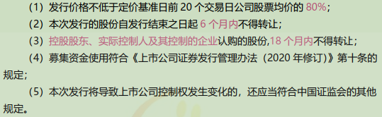

# 4.2 股票发行（4）

## 目录

1. 股票发行制度
2. 公开发行股票
3. 非公开发行股票
4. 股票退市

## 一、股票发行制度

股票发行制度是指发行人在申请发行股票时必须遵循的一系列程序化的规范，具体而言，表现在**发行监管制度**、**发行方式**与**发行定价**等方面。

审批制、核准制、注册制

* 审批制（完全计划发行）：采用行政计划的办法分配股票发行的指标和额度，由地方或行业主管部门根据指标推荐企业发行股票的一种发行制度。
* 核准制（中间模式）：一方面引进证券中介机构的责任，另一方面证券监管机构对股票发行进行实质性审查
* 注册制（成熟股票市场）：证券监管部门公布股票发行的必要条件，只要达到所公布条件要求的企业即可发行股票

保荐制度、发审委制度、承销制度

* 保荐制度：有资格的保荐人推荐符合条件的公司公开发行股票和上市，并对所推荐的发行人的信息披露质量和所作承诺提供持续训示、督促、辅导、指导和信用担保的制度。
* 发审委制度：由国务院证券监督管理机构的专业人员和所聘请的该机构外的有关专家，以投票方式对股票发行申请进行表决，提出审核意见。
* 承销制度：包销是指承销商将发行人的股票按照协议全部购入或者在承销期结束时将售后剩余股票全部自行购入的承销方式；代销是指承销商代发行人发售股票，在承销期结束时，将未售出的股票全部退还给发行人的承销方式。

## 二、公开发行股票

公开发行股票，是指发行人向不特定对象发行股票或向特定对象发行股票累计超过两百人；

### 首次公开发行股票（IPO）

首次公开发行股票（IPO），是指公司首次在证券市场公开发行股票募集资金并上市的行为

发行方式：

* 网下发行
* 网上发行
* 向战略投资者配售

发行条件：

1. 健全且运行良好的组织机构，具有持续经营能力
2. 最近三年财务会计报告被出具无保留意见审计报告
3. 发行人及其控股股东、实际控制人最近三年不存在贪污、贿赂、侵占财产、挪用财产或者破坏社会主义市场经济秩序的刑事犯罪
4. 经国务院批准的国务院证券监督管理机构规定的其他条件。

### 上市公司公开发行股票

上市公司公开发行股票，是指上市公司向不特定对象公开发行股票的行为。

主板（中小企业版）发行条件：

1. 组织机构健全、运行良好
2. 盈利能力具有可持续性
3. 财务状况良好
4. 最近36个月内财务会计文件无虚假记载，且不存在重大违法行为
5. 募集资金的数额和使用应当符合规定

创业板发行条件

科创板发行条件

## 三、非公开发行股票

非公开发行股票（定向增发），是指上市公司采用非公开方式向特定对象发行股票的行为

主板（中小企业版）发行条件

创业板发行条件

科创板发行条件

## 四、股票退市

股票退市，是指上市公司股票在证券交易所终止上市交易，包括主动退市、强制退市。

