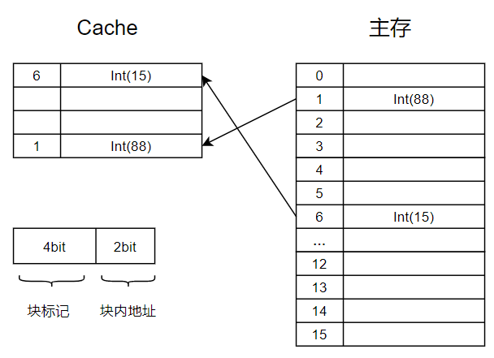

## cache 全相联模型

### 目录

1. 项目需求
2. 实现思路
3. 具体代码
4. 总结


### 项目需求

实现一个全相联cache，要求：

* 能够对访问过的内存块进行缓存
* 在cache装满时，替换算法为先进先出


### 实现思路

1. 由于cache为相联存储器，按内容访问，所以可以用map来模拟cache；而主存为随机存储器，按地址访问，所以可以用数组来模拟主存
2. 我们将主存大小设定为16块，每个块4个字节，再将cache设定为4行，用于对访问过的主存块做缓存。



3. 那么当主存块调入cache时，需要记录该块主存地址的高位，作为映射cache块的块标记。当下一次发起访问时，先访问cache，如果访问地址的高位，存在于cache的标记阵列中，说明cache命中，根据块标记取出相应块；如果不存在，说明cache未命中，则直接访问主存，并将访问块调入cache中。
4. 在调入cache的过程中，如果cache未满，则随机装入，如果cache满了，则执行先进先出算法，替换相应块。


### 具体代码

主存类

```java
package cache;

/**
 * 主存，提供操作主存的方法
 */
public class Memory {
    private int[] memory = new int[16];

    public void initMemory(int[] inputs) {
        for (int i = 0; i < memory.length && i < inputs.length; i++) {
            memory[i] = inputs[i];
        }
    }

    public int getMemData(int address) {
        try {
            System.out.println("IO操作");
            Thread.sleep(1000);
        } catch (InterruptedException e) {
            e.printStackTrace();
        }
        return memory[address];
    }

    public void setMemoryData(int address, int data) {
        try {
            System.out.println("IO操作");
            Thread.sleep(1000);
        } catch (InterruptedException e) {
            e.printStackTrace();
        }
        memory[address] = data;
    }
}

```


缓存类

```java
package cache;

import java.util.ArrayDeque;
import java.util.HashMap;

/**
 * 缓存，提供操作缓存的方法
 */
public class Cache {
    private static final int MAX = 4; //Cache最大容量

    private HashMap<String, Integer> cache = new HashMap<>();
    private ArrayDeque<String> queue = new ArrayDeque<>(); //记录装入顺序

    public void initCache() {
        cache.clear();
    }

    public boolean isCache(String tag) {
        return cache.containsKey(tag);
    }

    public void setCacheData(String tag, int data) {
        // 若cache装满，则替换最早装入的块
        if (queue.size() == MAX) {
            String oldTag = queue.pop();
            cache.remove(oldTag);
        }
        queue.offer(tag);
        cache.put(tag, data);
    }

    public int getCacheData(String tag) {
        return cache.get(tag);
    }
}

```


存储系统

```java
package cache;

/**
 * 存储系统
 */
public class Storage {
    private Cache cache;
    private Memory memory;

    public Storage(Cache cache, Memory memory) {
        this.cache = cache;
        this.memory = memory;
    }

    public int getData(int address) {
        String tag = Integer.toString(address);
        // 若cache命中
        if (cache.isCache(tag)) {
            return cache.getCacheData(tag);
        } else {
            int data = memory.getMemData(address);
            cache.setCacheData(tag, data);
            return data;
        }
    }
}

```


测试类

```java
package cache;

public class Main {
    public static void main(String[] args) {
        //构建cache
        Cache cache = new Cache();
        cache.initCache();

        //构建主存
        Memory memory = new Memory();
        memory.initMemory(new int[]{0,88,0,0,0,0,15,0,0,0,0,0,0,0,0,0});

        //构建存储系统
        Storage storage = new Storage(cache, memory);

        for (int i = 0; i < 4; i++) {
            System.out.println(storage.getData(i));
        }

        for (int i = 0; i < 8; i++) {
            System.out.println(storage.getData(i));
        }
    }
}

```


测试结果

```
IO操作
0
IO操作
88
IO操作
0
IO操作
0
0
88
0
0
IO操作
0
IO操作
0
IO操作
15
IO操作
0
```


### 总结

Cache与主存之间的地址映射方法有，全相联映射、直接映射、组相联映射，以上代码仅实现了Cache映射的模型之一，其他两种模型有待我们探索并实现。

除此之外，该项目仅实现了存储系统读数据的过程，并未实现写数据的过程，而该过程是真正困难的，因为我们需要保证cache和主存之间的写一致性问题，当然，存在多种方法可以保证这种一致性，那么这个课题就留给以后吧。


