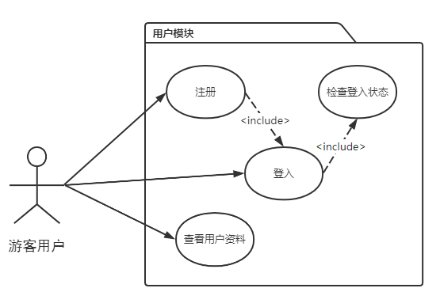
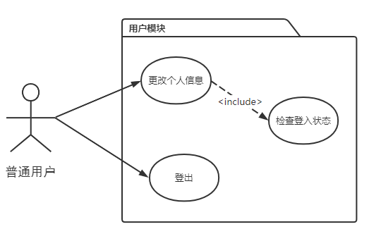
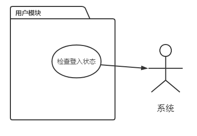

# 1.1 用户模块需求

## 目录

1. 游客用户需求
2. 普通用户需求
3. 系统需求

## 1. 游客用户需求

未登录用户拥有最低权限，在用户模块下有三项需求

* 注册：提交注册表单，增加新用户
* 登录：提交登入表单，进行登入验证
* 查看用户资料：查看平台用户的资料介绍

## 2. 普通用户需求

普通用户为已登入的低权限用户，在用户模块下有两项需求

* 更改个人信息：提交个人信息表单，更新个人信息

* 登出：用户下线，退出服务端会话，并覆盖客户端cookie

## 3. 系统需求

用户模块下，平台需要具备的功能如下

* 检查登录状态：在操作时，系统可以判断当前的用户会话是否有效

