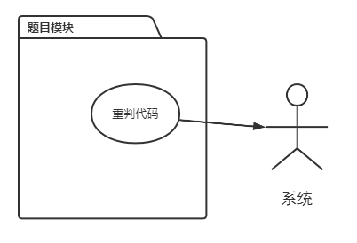

# 1.2 题目模块需求

## 目录

1. 游客用户需求
2. 普通用户需求
3. 出题用户需求
4. 管理员用户需求
5. 系统需求

## 1. 游客用户需求

未登录用户拥有最低权限，在题目模块下有4项需求

* 罗列题目：提交参数表单，对题目进行过滤、排序、分页

* 查看题目：获取题目信息
* 罗列提交：提交参数表单，对提交进行过滤、排序、分页
* 访问原始链接：访问原始OJ的题目链接

## 2. 普通用户需求

普通用户为已登入的3级权限用户，在题目模块下有5项需求

* 题面投票：为出题的题面描述投票
* 非比赛提交：在非比赛提交页面中，提交代码相关的表单
* 查看代码(个人)：查看个人提交的源代码
* 切换代码公开性(个人)：设置个人源代码公开或私有
* 获取编译信息(个人)：获取个人某提交的编译信息

## 3. 出题用户需求

出题用户为已登入的2级权限用户，在题目模块下有3项需求

* 更新题目：对当前题目重新爬取
* 修改题面：提交题面表单，修改题面
* 删除题面(个人)：删除个人修改的题面

## 4. 管理员用户需求

管理员用户为已登入的1级权限用户，在题目模块下有3项需求

* 查看代码：查看所有用户提交的源代码
* 获取编译信息：获取所有用户的编译信息
* 删除题面：删除修改的题面

## 4. 系统需求

题目模块下，平台需要具备的功能如下

* 重判代码：对状态异常的提交进行重判

