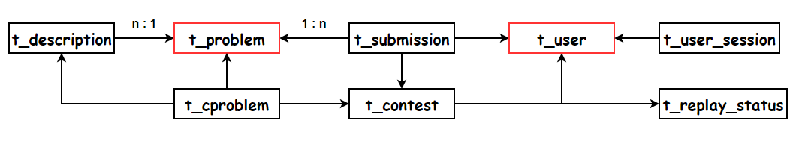

# 2.4 数据库设计

## 目录

1. 表关系
2. 表字段

## 一、表关系

| 表名称          | 说明       | one-to-many                        | many-to-one                 |
| --------------- | ---------- | ---------------------------------- | --------------------------- |
| t_user          | 用户信息表 | submissions/contests/user_sessions |                             |
| t_problem       | 题目信息表 | submissions/descriptions/cproblems |                             |
| t_replay_status | 比赛录像表 | contests                           |                             |
| t_description   | 题面信息表 | cproblems                          | problem                     |
| t_contest       | 比赛信息表 | submissions/cproblems              | user/replay_status          |
| t_submission    | 提交记录表 |                                    | user/problem/contest        |
| t_cproblem      | 赛题快照表 |                                    | problem/description/contest |
| t_user_session  | 用户会话表 |                                    | user                        |

## 二、表字段

* t_user：用户信息表

| 字段名称     | 类型              | 说明               |
| ------------ | ----------------- | ------------------ |
| id           | Integer           | 统编id             |
| username     | String            | 账户               |
| password     | String            | 密码               |
| nickname     | String            | 昵称               |
| qq           | String            | QQ号               |
| school       | String            | 学校               |
| email        | String            | 邮箱               |
| blog         | String            | 简介               |
| share        | Integer           | 代码是否公开       |
| sup          | Integer           | 权限               |
| submissions  | Set\<Submission>  | 用户级联的所有提交 |
| contests     | Set\<Contest>     | 用户级联的所有比赛 |
| userSessions | Set\<UserSession> | 用户级联的所有会话 |

* t_problem：题目信息表

| 字段名称     | 类型              | 说明                   |
| ------------ | ----------------- | ---------------------- |
| id           | Integer           | 统编id                 |
| title        | String            | 标题                   |
| source       | String            | 出处                   |
| url          | String            | 题目原始路径           |
| originOJ     | String            | 原始OJ                 |
| originProb   | String            | 原始OJ题号             |
| memoryLimit  | Integer           | 内存限制(KB)           |
| timeLimit    | Integer           | 时间限制(ms)           |
| triggerTime  | Date              | 上次尝试更新题面的时间 |
| descriptions | Set\<Description> | 题目级联的所有题面     |
| submissions  | Set\<Submission>  | 题目级联的所有提交     |
| cproblems    | Set\<Cproblem>    | 题目级联的所有赛题     |

* t_replay_status：比赛录像表

| 字段名称 | 类型          | 说明               |
| -------- | ------------- | ------------------ |
| id       | Integer       | 统编id             |
| data     | String        | 录像数据           |
| contests | Set\<Contest> | 录像级联的所有比赛 |

* t_description：题面信息表

| 字段名称     | 类型           | 说明               |
| ------------ | -------------- | ------------------ |
| id           | Integer        | 统编id             |
| description  | String         | 题面描述           |
| input        | String         | 输入介绍           |
| output       | String         | 输出介绍           |
| sampleInput  | String         | 样例输入           |
| sampleOutput | String         | 样例输出           |
| hint         | String         | 提示               |
| updateTime   | Date           | 上次成功更新时间   |
| author       | String         | 作者               |
| remarks      | String         | 备注               |
| vote         | Integer        | 点赞数             |
| problem      | Problem        | 题面从属的题目     |
| cproblems    | Set\<Cproblem> | 题面级联的所有赛题 |

* t_contest：比赛信息表

| 字段名称          | 类型             | 说明               |
| ----------------- | ---------------- | ------------------ |
| id                | Integer          | 统编id             |
| title             | String           | 标题               |
| description       | String           | 描述               |
| announcement      | String           | 公告               |
| password          | String           | 密码               |
| beginTime         | Date             | 开始时间           |
| endTime           | Date             | 结束时间           |
| hashCode          | String           | 哈希值             |
| enableTimeMachine | Integer          | 时间机器           |
| manager           | User             | 比赛从属的用户     |
| replayStatus      | ReplayStatus     | 比赛从属的录像     |
| cproblems         | Set\<Cproblem>   | 比赛级联的所有赛题 |
| submissions       | Set\<Submission> | 比赛级联的所有提交 |

* t_submission：提交记录表

| 字段名称          | 类型    | 说明             |
| ----------------- | ------- | ---------------- |
| id                | Integer | 统编id           |
| status            | String  | 原生状态         |
| statusCanonical   | String  | 枚举状态         |
| additionalInfo    | String  | 编译信息         |
| realRunId         | String  | 原OJ的RunId      |
| time              | Integer | 运行时间(ms)     |
| memory            | Integer | 运行内存(KB)     |
| language          | String  | 语言映射key      |
| source            | String  | 源代码           |
| subTime           | Date    | 提交时间         |
| isOpen            | Integer | 代码是否公开     |
| dispLanguage      | String  | 语言映射value    |
| username          | String  | 提交者用户名     |
| originOJ          | String  | 原始OJ           |
| originProb        | String  | 原始OJ题号       |
| remoteAccountId   | String  | 交题账号         |
| remoteSubmitTime  | Date    | 原始OJ提交时间   |
| queryCount        | Integer | 累计查询状态次数 |
| statusUpdateTime  | Date    | 最后查询状态时间 |
| isPrivate         | Integer | 是否不公开       |
| languageCanonical | String  | 枚举语言         |
| contestNum        | String  | 赛题字母         |
| user              | User    | 提交从属的用户   |
| problem           | Problem | 提交从属的题目   |
| contest           | Contest | 提交从属的比赛   |

* t_cproblem：赛题快照表

| 字段名称   | 类型        | 说明           |
| ---------- | ----------- | -------------- |
| id         | Integer     | 统编id         |
| num        | String      | 赛题字母       |
| title      | String      | 赛题标题       |
| problem    | Problem     | 赛题从属的题目 |
| contest    | Contest     | 赛题从属的比赛 |
| descripton | Description | 赛题从属的题面 |

* t_user_session：用户会话表

| 字段名称     | 类型    | 说明           |
| ------------ | ------- | -------------- |
| id           | Integer | 统编id         |
| arriveTime   | Date    | 抵达时间       |
| loginTime    | Date    | 登入时间       |
| leaveTime    | Date    | 离开时间       |
| userAgent    | String  | 客户端         |
| referer      | String  | 页面参照       |
| ip           | String  | ip地址         |
| loginSuccess | Integer | 是否登入成功   |
| user         | User    | 会话从属的用户 |

