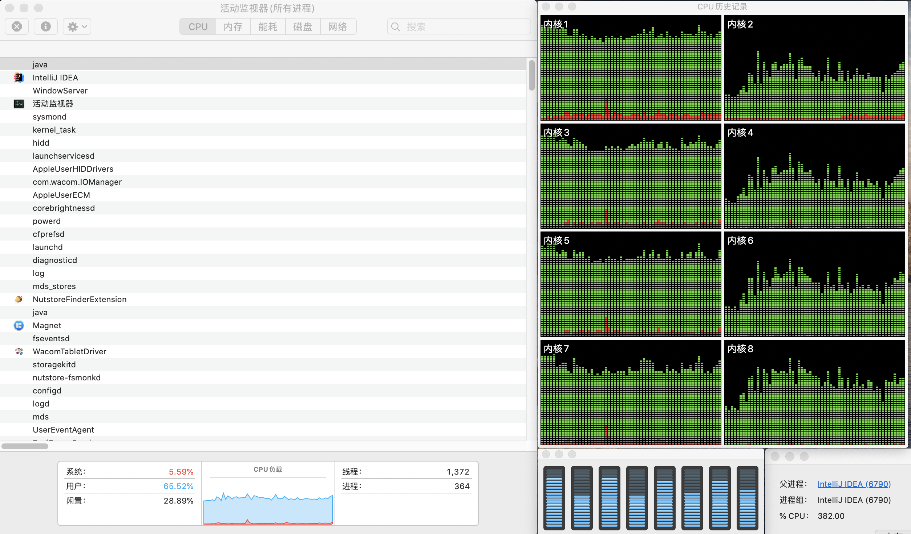
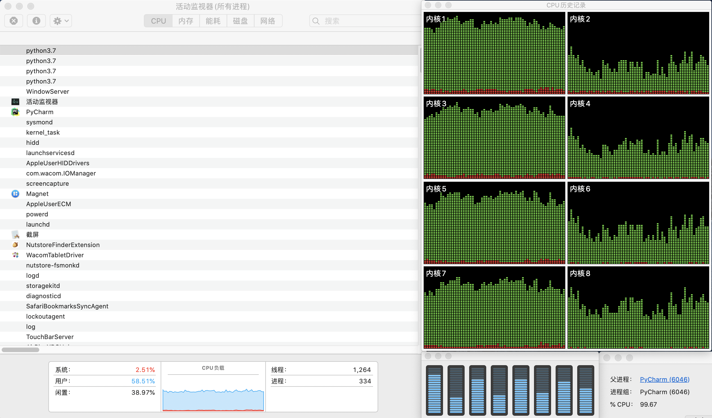
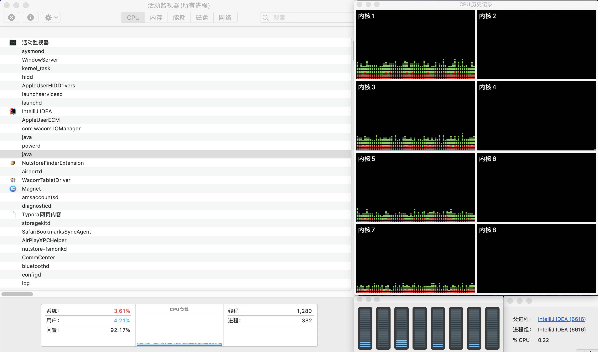

# CPU与线程


## 目录

1. CPU与线程
2. 查看CPU信息
3. 性能评估
4. 参考资料


## 一、CPU与线程

逻辑cpu数 = 物理cpu数 * 每个物理cpu的核心数 * 每个核心的超线程数

* 一台完整的计算机可能包含一到多个物理cpu
* 一个物理cpu可能是单核心、双核心、甚至是多核心的
* 通过超线程技术，一个核心在同一时刻可以执行多条线程


## 二、查看CPU信息

Linux环境

```bash
## 查看CPU信息
lscpu
## 查看物理CPU数
cat /proc/cpuinfo| grep "physical id"| sort| uniq| wc -l
## 查看每个物理CPU中的核心数
cat /proc/cpuinfo | grep "cpu cores" | uniq
## 查看逻辑CPU数
cat /proc/cpuinfo| grep "processor"| wc -l
## 查看CPU型号
cat /proc/cpuinfo | grep name | cut -f2 -d: | uniq -c
```

Mac环境

```bash
## 查看CPU型号
sysctl machdep.cpu.brand_string
## 查看每个物理CPU中的核心数
sysctl hw.physicalcpu
## 查看逻辑CPU数
sysctl hw.logicalcpu
```

本机测试

```bash
(base) ➜  ~ sysctl machdep.cpu.brand_string
machdep.cpu.brand_string: Intel(R) Core(TM) i5-8257U CPU @ 1.40GHz
(base) ➜  ~ sysctl hw.physicalcpu
hw.physicalcpu: 4
(base) ➜  ~ sysctl hw.logicalcpu
hw.logicalcpu: 8
```


## 三、性能评估

在4核8线程的CPU环境下进行性能评估，执行以下操作并获取相应结果。


1）四条线程执行计算任务

* 操作说明：在Java语言环境下启动4条线程，每条线程负责将`count++`执行1千亿次

* 测试结果
  * cpu占用率：71.11%
  * 时间消耗：108秒





2）四条进程执行计算任务

* 操作说明：在Python语言环境下启动4条进程，每条进程负责将`count++`执行1千亿次
* 测试结果：cpu占用率为61.03%




3）N条线程执行IO任务

* 操作说明：在Java语言环境下启动32条线程，每条线程负责将`Thread.sleep(1000)`执行1千次

* 测试结果：cpu占用率为7.83%




## 参考资料

* [CPU核心数与线程数](https://zhuanlan.zhihu.com/p/86855590)

