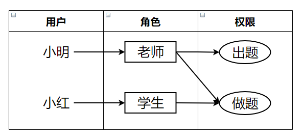

## RBAC权限管理模型

### 目录

1. 项目需求
2. 实现思路
3. 具体代码
4. 总结
5. Q&A


### 项目需求

实现权限管理模型，要求如下：

1. 可以为用户分配不同的角色，比如指定用户为老师，指定用户为学生

2. 可以为角色分配不同的权限，比如老师可以出题、做题，学生仅可以做题


### 实现思路

* 首先建立三个类，用户类、角色类、权限类，并配实体关系如下：



* 建立测评系统类，该类有两个方法：出题、做题

```java
public void setQuestion();
public void doQuestion();
```


* 当测评方法被调用时，获取当前用户所拥有的全部权限
  * 如果权限符合，则执行接口方法
  * 如果权限不符，则返回权限不足


### 具体代码

用户类、角色类以及权限类

```java
package rbac;

import java.util.ArrayList;

/**
 * 用户类
 */
class User {
    String name;
    ArrayList<Role> roles = new ArrayList<Role>();

    User(String name) {
        this.name = name;
    }
}

/**
 * 角色类
 */
class Role {
    String name;
    ArrayList<Authority> authorities = new ArrayList<Authority>();

    Role(String name) {
        this.name = name;
    }

}

/**
 * 权限类
 */
class Authority {
    String name;

    Authority(String name) {
        this.name = name;
    }
}

```


评测系统

```java
package rbac;

import java.util.ArrayList;

/**
 * 测评系统，系统支持出题和做题
 */
class Judge {
    static Authority SETQUE = new Authority("出题");
    static Authority DOQUE = new Authority("做题");

    void setQuestion(User user) {
        if (isAuth(user, SETQUE)) {
            System.out.println(user.name + "允许出题");
        } else {
            System.out.println(user.name + "无出题权限");
        }
    }

    void doQuestion(User user) {
        if (isAuth(user, DOQUE)) {
            System.out.println(user.name + "允许做题");
        } else {
            System.out.println(user.name + "无做题权限");
        }
    }

    private boolean isAuth(User user, Authority auth) {
        for (Role role : user.roles) {
            for (Authority authority: role.authorities) {
                if (auth.equals(authority)) {
                    return true;
                }
            }
        }
        return false;
    }
}

```


测试类

```java
package rbac;

public class Main {
    public static void main(String[] args) {
        //配置权限关系
        Role ro1 = new Role("老师");
        ro1.authorities.add(Judge.SETQUE);
        ro1.authorities.add(Judge.DOQUE);
        Role ro2 = new Role("学生");
        ro2.authorities.add(Judge.DOQUE);

        User us1 = new User("小明");
        us1.roles.add(ro1);
        User us2 = new User("小红");
        us2.roles.add(ro2);

        //调用测评方法
        Judge judge = new Judge();
        judge.doQuestion(us1);
        judge.setQuestion(us1);
        judge.doQuestion(us2);
        judge.setQuestion(us2);
    }
}

```


测试结果

```shell
小明允许做题
小明允许出题
小红允许做题
小红无出题权限
```


### 总结

从以上的代码可以看出，测评系统具备的权限和其接口对应，是相对固定的，由于只开发了出题和做题两个接口，所以权限也固定为两个。

但是在此基础上我们可以进行角色的自由配置，形成不同的权限组合，并且可以方便地在后续管理过程中使用我们的权限组合，为不同的用户分配相应的角色。比如，除了老师和学生之外，我们可以增加家长角色，家长不能做题也不能出题，专门分配给那些仅仅需要登入平台的用户。

因此权限管理系统适用于，权限接口非常多，用户增量大的场景中。


### Q&A

**Q1：**

若直接查表判断权限，将消耗大量的IO资源？

**A1：**

对用户权限做缓存，将每一次权限查取的IO操作，替换为对内存的操作


**Q2：**

Map、Redis、Session 均可做用户权限缓存，它们的区别是什么？

**A2：**

Map是内存中的映射结构，其容量和内存相关，无法在多实例间共享；Redis是缓存数据库，其容量可虚拟化，可以在多实例间共享；Session是一种受限Map结构，用户会话需要和登入状态保持一致。

