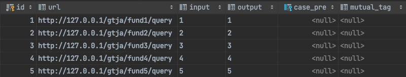

## 测试案例调度系统

*在保证互斥有序的前提下，能够并发执行批量的测试用例*

### 目录
1. 简介
2. 技术选型
3. 系统架构
4. 调度方案
5. 数据库设计
6. 性能评估

### 一、简介
测试案例调度系统（Test case scheduling system，简称TCSS），提供了一套针对大批量的测试用例，能够实现高效分批执行的用例执行方案。

TCSS的目标是解决以下三个问题：
* 分布式执行测试案例
* 部分案例可以不同时执行
* 部分案例可以按顺序执行

比如，公司每天需要批量评测1万条测试案例，你可以分5台机器，每台机器执行2000条，但是里面有一些案例可能不能同时执行，程序要怎么解决这个问题（TCSS）

### 二、技术选型

| 技术                 | 说明           | 官网                                            |
| -------------------- | -------------- | ----------------------------------------------- |
| Spring Boot          | 容器+WEB框架   | https://spring.io/projects/spring-boot          |
| Spring Cloud Alibaba | 微服务框架     | https://spring.io/projects/spring-cloud-alibaba |
| Mybatis-plus         | ORM框架        | https://baomidou.com                            |
| MySQL                | 数据库         |                                                 |
| Nacos                | 注册、配置中心 | https://nacos.io                                |

### 三、系统架构

TCSS的系统架构如下图所示。其中，后台服务负责测试任务的调度和分配，如果当前任务处于可执行状态，那么该任务会被分配给一台资源空闲的测试服务；测试服务负责测试任务的具体执行，我们可以部署多台测试服务实例来构建测试服务集群，从而提高系统对批量测试任务的并发处理能力。

### 四、调度方案

测试用例的调度流程有以下步骤：

1. 用户可以在操作页面选择批量测试用例，然后点击执行。
2. 后台服务在接收到用户的执行请求后，首先从MySQL中获取批量测试用例，然后将所有测试任务提交到就绪队列中，最后返回给用户一个操作已经完成的提示。
3. 守护线程为一个单线程的while循环，它负责依次从就绪队列中获取测试任务并进行处理。如果当前任务不允许运行，则将该任务放入阻塞队列进行等待；如果当前任务允许运行，则启动子线程执行当前任务。
4. 多个子线程可以并发的执行多个测试任务。子线程首先从Nacos中获取健康可用的测试服务实例列表，如果当前列表中所有的实例都资源繁忙，则线程等待；如果当前列表中存在资源空闲的测试服务实例，则发送测试请求。
5. 测试服务在接收到后台服务的测试请求后，会调用相应的测试接口地址进行用例测试，并将测试结果存入数据库中。一个测试服务实例在资源足够的情况下可以同时处理多个测试任务，多个测试服务实例则可以同时处理大批量的测试任务。

#### 1）守护线程

**守护线程是什么**

守护线程存在于后台服务中，它随着容器启动而诞生，随着容器销毁而结束。守护线程本质上是一个单线程的while循环，负责依次从队列中获取测试任务并进行处理。

**守护线程的工作流程**

守护线程的工作包括两部分：获取测试任务、处理测试任务。在获取测试任务的过程中，守护线程会优先检查就绪队列，其次检查阻塞队列，如果就绪队列和阻塞队列均为空，则守护线程将进入等待，直到就绪队列里有了新的任务，守护线程才会被唤醒；如果就绪队列或阻塞队列非空，则守护线程将从非空队列中获取测试任务，并对任务进行处理。在处理测试任务的过程中，守护线程首先会检查当前任务的前置任务是否已经完成，以及当前任务的互斥任务是否正在运行，如果存在前置任务尚未完成，或存在互斥任务正在运行，则当前任务不被允许执行，守护线程会把当前任务加入阻塞队列中；如果全部前置任务均已结束，全部互斥任务均不在运行，则守护线程会开启子线程来执行当前任务。由于守护线程是一个单线程的while循环，所以上述获取测试任务、处理测试任务的过程会被反复执行。

**守护线程的作用**

守护线程和二级队列是相辅相成的。其中，就绪队列用来缓存大批量的测试任务，它是一个很好的缓冲区，如果没有就绪队列，后台服务会立即执行到来的所有测试任务，这些测试任务会带来大量的并发，从而耗尽系统的计算资源。守护线程用来依次处理缓存的测试任务，其单线程的特性保证了同一时间只有一个任务在被调度，一旦当前任务被确定为可以执行，守护线程便会启用子线程来并发的运行这些任务。阻塞队列用来缓存不可执行的任务，它利用队列先进先出的特性，调换了不可执行任务的执行顺序，等到互斥任务和前置任务执行完毕后，这些不可执行的任务也就变成可执行了。

#### 2）子线程

**子线程是什么**

守护线程在调度任务的过程中，一旦确定了当前任务可以并发执行，就会把该任务提交至线程池。子线程是指由线程池管理的核心线程或非核心线程，负责并发执行由守护线程提交的可执行任务。

**子线程的工作流程**

子线程的工作包括两部分：获取空闲实例、发送测试请求。在获取空闲实例的过程中，子线程首先会查询Nacos获取健康可用的测试服务实例列表，接着会检查每个测试服务实例的当前任务数量，如果不存在任务资源空闲的测试服务实例，则子线程会等待2秒，然后把当前任务重新提交至线程池；如果存在任务资源空闲的测试服务实例，则子线程会向该实例发送测试请求。发送测试请求也包括两种情况，如果测试请求发送成功，则子线程结束；如果测试请求发送失败，则子线程等待2秒，然后把当前任务重新提交至线程池。

**子线程的作用**

任务的调度包括两个过程，守护线程依次判断任务是否可以并发执行，子线程并发的分配可执行任务到不同的测试服务实例上。在上述过程中，子线程可以最大限度的提升任务分配环节的并发性能，如果没有子线程，那么可执行任务的判断和分配都将交由守护线程，考虑到守护线程的单线程特性，其执行效率是不够乐观的。

### 五、数据库设计

* 测试用例表（test_case）：测试用例规定了接口的输入和输出，用于检测接口是否能正常工作

| 字段名称     | 字段类型 | 键   | 备注         |
| ------------ | -------- | ---- | ------------ |
| id           | Long     | 主键 | 用例id       |
| url          | String   |      | 测试接口地址 |
| input        | String   |      | 用例输入     |
| output       | String   |      | 用例输出     |
| case_pre     | Long     | 外键 | 前置用例     |
| mutual_tag   | String   |      | 互斥标签     |
| gmt_create   | Date     |      | 创建时间     |
| gmt_modified | Date     |      | 修改时间     |
| isDelete     | Short    |      | 是否删除     |

* 测试记录表（test_record）：测试用例的每一次执行，都需要留有相应的记录

| 字段名称     | 字段类型 | 键   | 备注     |
| ------------ | -------- | ---- | -------- |
| id           | Long     | 主键 | 记录id   |
| case_id      | Long     | 外键 | 用例id   |
| result       | String   |      | 测试结果 |
| status       | String   |      | 测试状态 |
| gmt_create   | Date     |      | 创建时间 |
| gmt_modified | Date     |      | 修改时间 |
| isDelete     | Short    |      | 是否删除 |

* 测试实例表（test_instance）：测试服务的各个实例的并发资源均在此表动态维护

| 字段名称     | 字段类型 | 键   | 备注               |
| ------------ | -------- | ---- | ------------------ |
| id           | Long     | 主键 | 实例id             |
| name         | String   |      | 服务名称           |
| url          | String   |      | 实例地址 ip:port   |
| task_num     | Integer  |      | 当前任务数         |
| max_task_num | Integer  |      | 最大任务数         |
| version      | Long     |      | 版本号，实现乐观锁 |
| gmt_create   | Date     |      | 创建时间           |
| gmt_modified | Date     |      | 修改时间           |
| isDelete     | Short    |      | 是否删除           |

### 六、性能评估

#### 1）批量执行一般用例

* 操作说明：已知一个用例耗时3秒，以下5个案例重复执行1000次（共计执行5000次）

* 实例说明：启动两台服务实例，每台实例的最大任务数为5（共计并发量为10）

* 测试结果
  * 成功率：100%
  * 预期时间：5000 * 3 / 10 = 1500秒
  * 实际时间：13:45:17 - 14:10:25 = 25 * 60 + 8 = 1508秒

#### 2）批量执行顺序用例

* 操作说明：已知一个用例耗时3秒，以下4个顺序案例重复执行500次（共计执行2000次）

* 实例说明：启动两台服务实例，每台实例的最大任务数为5（共计并发量为10）

* 测试结果
  * 成功率：100%
  * 预期时间：2000 * 3 / 10 = 600秒
  * 实际时间：23:32:13 - 23:42:18 = 10 * 60 + 5 = 605秒
  * 是否顺序：仅当所有的案例1处于终止态（status=02），案例2才能开始运行

#### 3）批量执行互斥用例

* 操作说明：已知一个用例耗时3秒，以下4个互斥案例重复执行250次（共计执行1000次）

* 实例说明：启动一台服务实例，该实例的最大任务数为4（共计并发量为4）

* 测试结果

  * 成功率：100%

  * 预期时间：1000 * 3 / 4 = 750秒

  * 实际时间：22:14:36 - 22:27:58 = 13 * 60 + 22 = 802秒
  * 是否互斥：同时处于运行态（status=01）的只有不同的案例（case_id:1,2,3,4），相同的案例无法同时运行

