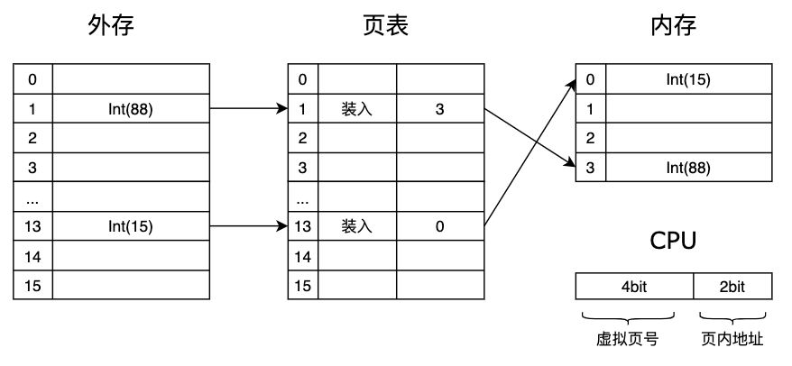

## 虚拟存储模型

### 目录

1. 项目需求
2. 实现思路
3. 具体代码
4. 总结


### 项目需求

实现虚拟存储器模型，要求如下：

* 内存容量过小，需借助外存扩充内存

* 在内存装满时，换页算法为先进先出


### 实现思路

1. 内存为随机访问存储器，按地址访问，可以用数组模拟实现；外存设备采用固态硬盘，随机读写，也使用数组模拟实现。
2. 假设内存为4页，每页4字节，外存为16页，CPU无法直接访问外存，需要将相应页调入内存进行访问，为了识别外存页，需要增设页表，忽略页表对内存的占用。




3. 在访问虚拟存储器之前，CPU需要先访问页表，如果页表中记录了虚拟页面的实页号，说明页表命中，目标页已经调入了内存之中，之后访问实页号指向的内存地址即可；如果页表中未记录虚拟页面的实页号，说明页表未命中，需要将目标页调入内存之中，并更新页表，然后重新发起访问。
4. 在页面调入内存的过程中，如果内存未满，则按顺序调入，如果内存满了，则执行先进先出的换页策略。


### 具体代码

外存，提供操作外存的方法

```java
public class Disk {
  private int[] dataList = new int[16]; //硬盘数据
  
  public void init(); //硬盘初始化
  public int read(); //硬盘读出
  public void write(); //硬盘写入
}
```


内存，提供操作内存的方法

```java
public class Memory {
  private int[] dataList = new int[4]; //内存数据
  
  public void init(); //内存初始化
  public int read(); //内存读出
  public void write(); //内存写入
}
```


页表，标识外存页的装入情况

```java
public class Page {
  private Item[] itemList = new Item[16]; //页表内容
  private ArrayDeque<Integer> queue = new ArrayDeque<>(); //外存装入顺序
  
  public void init(); //页表初始化
  public boolean isValid();//访问页表
  public void load(); //装入外存页
  
  // 页表项
  class Item {
    private boolean valid;
    private int memNum;
  }
}
```


虚拟存储系统

```java
public class Storage {
  private Disk dist;
  private Memory memory;
  private Page page;
  
  public void getData(); //从存储系统中获取数据
  
  
}
```


### 总结

